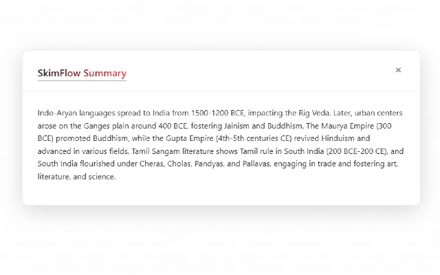

# SkimFlow AI 🚀


SkimFlow AI is a powerful Chrome extension that helps you read faster and smarter. It features Rapid Serial Visual Presentation (RSVP) for fast reading, AI-powered summarization, and smart text formatting to enhance your reading experience.

## Screenshots 📸

<p align="center">
  
  &nbsp;&nbsp;&nbsp;&nbsp;
  
</p>

## Features ✨

- **RSVP Reading**: Consume text at lightning speeds, word by word, allowing you to breeze through articles without eye fatigue.
- **Built-in AI Summarization**: Highlight any text on a page, right-click, and let SkimFlow instantly summarize it utilizing Google Chrome's native AI APIs (Gemini Nano)—no third-party API keys required!
- **Smart Formatting**: Adjust font sizes, weights, and colors dynamically for a distraction-free experience.

## Installation 🛠️

1. Clone this repository to your local machine:
   ```bash
   git clone https://github.com/YOUR_USERNAME/skimflow-ai.git
   cd skimflow-ai
   ```
2. Install dependencies:
   ```bash
   npm install
   ```
3. Build the project:
   ```bash
   npm run build
   ```
4. Load it in Chrome:
   - Go to `chrome://extensions/`
   - Enable **Developer mode**
   - Click **Load unpacked** and select the `/dist` folder.

## AI Configuration 🤖

To use the AI Summarization feature, you must enable Chrome's local summarization APIs. 
Ensure you are on Chrome version 131 or later and enable the following flag:
- `chrome://flags/#summarization-api-for-gemini-nano`

## Scripts 📜

- `npm run dev`: Start a Vite development server for the extension.
- `npm run build`: Build for production.
- `npm run deploy`: Creates a `.zip` in the root for Chrome Web Store publishing.

## License 📄

This project is licensed under the ISC License. See the [LICENSE](LICENSE) file for more information.
